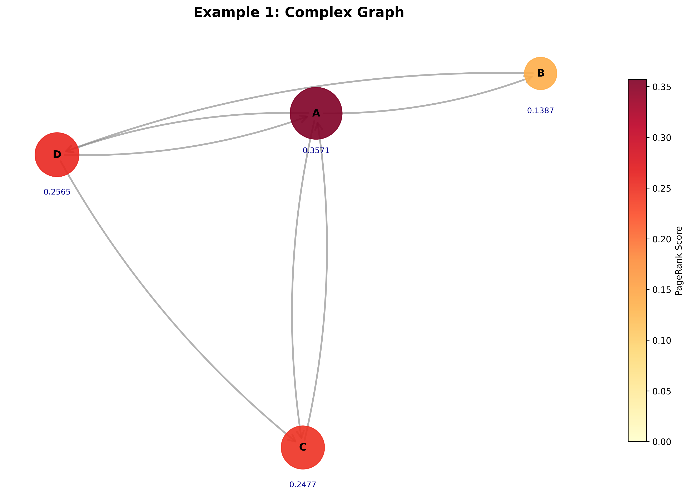
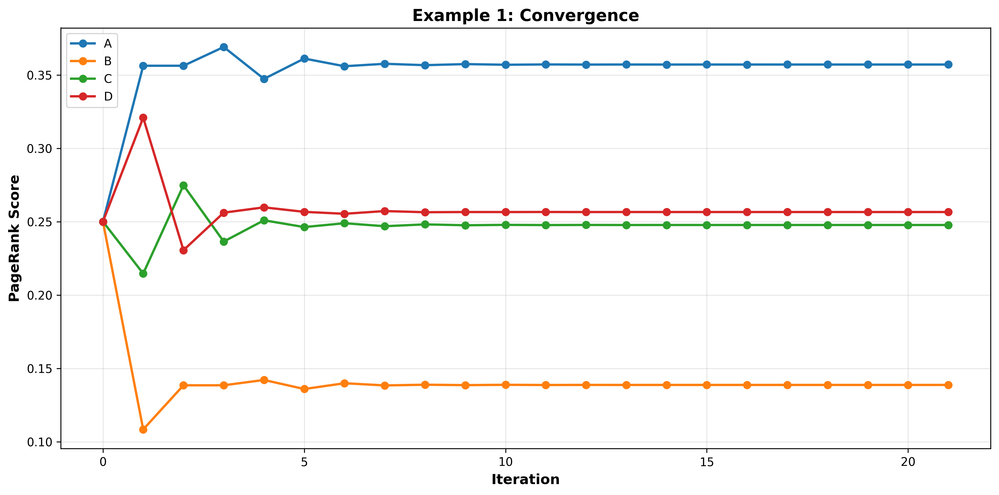
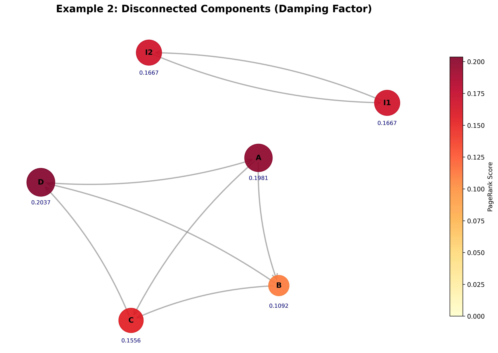
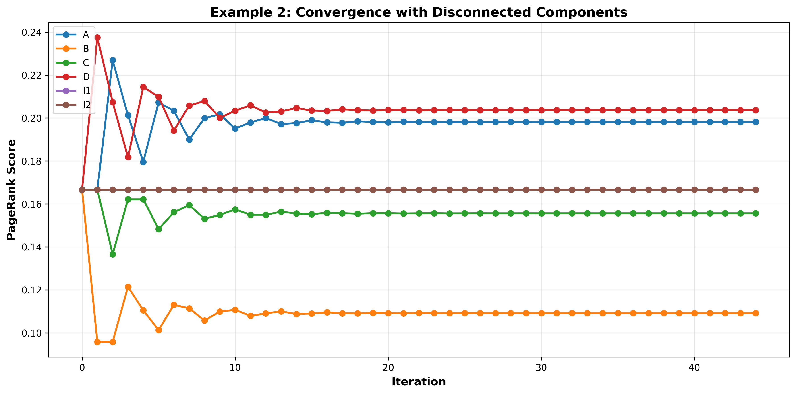
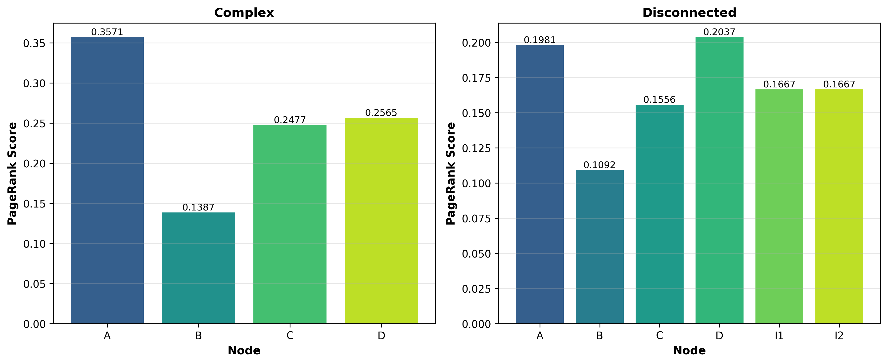

# PageRank Implementation

A Python implementation of the PageRank algorithm with visualization capabilities. This project demonstrates how PageRank works by computing importance scores for nodes in directed graphs and visualizing the results.

## Features

- **PageRank Algorithm**: Iterative computation of node importance scores using the damping factor
- **Graph Visualization**: Visual representation of graphs with node sizes proportional to PageRank scores
- **Convergence Analysis**: Track how PageRank scores converge over iterations
- **Multiple Examples**: Includes complex graphs and disconnected components to demonstrate the algorithm's behavior
- **Comparison Charts**: Compare PageRank results across different graph structures

## Requirements

- numpy
- networkx
- matplotlib

## Installation

```bash
pip install -r requirements.txt
```

## Usage

Run the main script to generate example PageRank computations and visualizations:

```bash
python main.py
```

### API Reference

#### `pagerank(graph, damping=0.85, max_iterations=100, tolerance=1e-6)`

Computes PageRank scores for nodes in a directed graph.

**Parameters:**
- `graph` (Dict[str, List[str]]): Adjacency list representing the graph, where keys are source nodes and values are lists of target nodes
- `damping` (float): Damping factor (default: 0.85), controlling random jumps through the graph
- `max_iterations` (int): Maximum number of iterations (default: 100)
- `tolerance` (float): Convergence threshold (default: 1e-6)

**Returns:**
- Tuple of (final_ranks, history) where final_ranks is a dictionary of node scores and history tracks scores over iterations

#### `visualize_graph(graph, ranks, title, filename=None)`

Creates a visualization of the graph with node sizes based on PageRank scores.

#### `plot_convergence(history, title, filename=None)`

Plots how PageRank scores converge over iterations for each node.

## Examples

### Example 1: Complex Graph
A more intricate network with multiple paths and cycles, showing how PageRank distributes importance across interconnected nodes.



**Convergence over iterations:**



### Example 2: Disconnected Components
Demonstrates how the damping factor allows PageRank to distribute scores even to isolated components that have no direct connections to other parts of the graph.



**Convergence over iterations:**



## Comparison



## Output Files

The script generates PNG visualizations:
- `pagerank_complex.png` - Graph visualization for complex example
- `convergence_complex.png` - Convergence plot for complex example
- `pagerank_disconnected.png` - Graph visualization for disconnected components
- `convergence_disconnected.png` - Convergence plot for disconnected example
- `pagerank_comparison.png` - Side-by-side comparison of PageRank scores

## Algorithm Details

PageRank models the probability that a random web surfer lands on a particular page. The formula is:

```
PR(A) = (1 - d) / N + d * Σ(PR(T) / C(T))
```

Where:
- `d` is the damping factor (probability of following a link vs. random jump)
- `N` is the total number of nodes
- `T` is a page linking to A
- `C(T)` is the number of outgoing links from T

## License

This project is open source.
